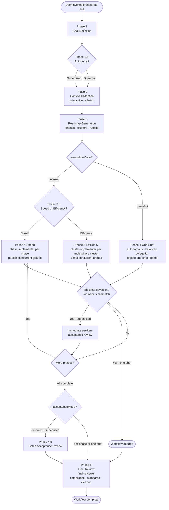

# dev-orchestrator

A Claude Code plugin for running large, multi-step development work as a structured 5-phase workflow with persistent state across sessions.

## TL;DR

You give it a development goal. It collects guidance, produces a phased roadmap with item-level dependency annotations, implements each phase via specialised subagents, and finally reviews the whole result against your original guidance. All progress lives in files under `.dev-orchestrator/`, so you can interrupt, compact, or restart your session and pick up where you left off. You choose how supervised (or fully autonomous) the run is, and whether to optimise for wall-clock speed or token efficiency.

## What it is

Large development stories outgrow a single chat session: too many decisions, too much loaded context, no recovery path when the model auto-compacts or you take a break. `dev-orchestrator` structures that work into five phases backed by a small set of specialised agents, each operating in its own context window. Decisions, specs, and progress live in `.dev-orchestrator/` files so any session — fresh, resumed, or post-compaction — can reconstruct state from disk.

## How it works (the five phases)

1. **Goal Definition** — Define the main topic and (optionally) split it into subtopics. Inline, no agent.
2. **Context Collection** — `guidance-collector` gathers docs, specs, code references, and constraints into a per-topic `guidance.md`. Runs serially with user Q&A (interactive) or structures pre-supplied inputs in parallel (batch).
3. **Roadmap Generation** — `roadmap-generator` decomposes each topic into ordered phases with checklist items, identifies context clusters (groups of phases that share enough setup to benefit from a single outer agent), and annotates each item with `Affects:` — the downstream items that would break if this one deviated from spec.
4. **Implementation** — `phase-implementer` executes each phase's checklist. In efficiency or one-shot mode for multi-phase clusters, `cluster-implementer` wraps it as a two-layer subagent topology so shared context is loaded once and per-phase residue stays isolated. Concurrency groups marked `[concurrent]` may run in parallel or serially depending on mode. Contract-affecting deviations are detected mechanically via `Affects:` and pause the workflow for immediate review (or abort it in one-shot).
5. **Final Review** — `final-reviewer` cross-references the implementation against guidance, flags deviations, runs project-standards checks (linting, conventions, CLAUDE.md compliance), and offers documentation integration plus workflow cleanup.

Between Phase 4 and Phase 5, supervised workflows with deferred acceptance run **Phase 4.5: Batch Acceptance Review**, where every accumulated `(acceptance)` item is reviewed in one batch.

## Mode choices

The workflow exposes four orthogonal mode dimensions:

| Dimension | Options | Asked at | Default |
|---|---|---|---|
| **Autonomy** | `supervised` / `one-shot` | Phase 1.5 (after topic definition) | supervised |
| **Execution strategy** | `speed` / `efficiency` | Phase 3.5 (supervised only, after roadmap exists) | efficiency if any multi-phase cluster, else speed |
| **Acceptance** | `per-phase` / `deferred` | Set automatically at Phase 1.5 | deferred (per-phase reachable only by manual manifest edit) |
| **Collection** | `interactive` / `batch` | Phase 2 entry (supervised); auto-batch in one-shot | interactive |

In short:

- **Supervised** pauses at meaningful decision points (roadmap review, acceptance review). Resumable.
- **One-shot** runs end-to-end autonomously. No per-topic `status.md`, no per-phase reviews. Faster, no resumption — a mid-workflow failure means restarting.
- **Speed** delegates one `phase-implementer` per phase and parallelises `[concurrent]` groups. Maximum wall-clock speed; each phase re-loads shared context.
- **Efficiency** delegates one `cluster-implementer` per multi-phase cluster. Shared context loaded once per cluster; concurrency groups serialise for maximum token savings.
- **Per-phase acceptance** reviews items after every phase.
- **Deferred acceptance** lets items accumulate across phases for one batch review at Phase 4.5. Contract-affecting deviations still pause Phase 4 for immediate review.

## Workflow at a glance

> The `Yes -> I` loop back from "More phases?" is illustrative; the orchestrator actually returns to whichever Phase 4 variant (`I`, `J`, or `H`) the workflow is in. Phase 4 iterates over all unfinished phases or clusters until none remain.

## Agents at a glance

| Agent | Role | Model / Effort |
|---|---|---|
| `guidance-collector` | Collects and structures per-topic guidance | opus / xhigh |
| `roadmap-generator` | Designs phases, identifies clusters, populates `Affects:` | opus / max |
| `phase-implementer` | Implements one phase's checklist | sonnet / high |
| `cluster-implementer` | Wraps phase-implementer for multi-phase clusters (efficiency, one-shot) | sonnet / high |
| `status-reviewer` | Read-only progress reporter | haiku / low |
| `final-reviewer` | Compliance + standards review at Phase 5 | opus / xhigh |

## State and resumption

All workflow state lives in `.dev-orchestrator/` at your project root:

- `manifest.json` — workflow identity, modes, session history
- `<topic-slug>/guidance.md` — collected context (Phase 2 output)
- `<topic-slug>/roadmap.md` — phased plan with cluster + `Affects:` annotations (Phase 3 output)
- `<topic-slug>/status.md` — item state and session log (supervised modes only)
- `status-overview.md` — cross-topic dashboard (supervised, multi-topic)
- `one-shot-log.md` — append-only forensic log (one-shot mode only)

Supervised workflows are fully resumable: re-invoke the skill in the same project directory, and it reads `manifest.json` to pick up where it left off. A `PreCompact` hook persists state automatically when Claude Code auto-compacts.

One-shot workflows do **not** support resumption — by design, they trade checkpointing overhead for autonomous speed.

## Token-efficiency design

Three layered mechanisms keep the orchestrator thread lean:

1. **Subagent delegation** — heavy work (file reads, edits, sub-sub-agents) runs in dedicated agents with their own context windows. Only structured handoff summaries return to the orchestrator.
2. **Two-layer isolation in efficiency / one-shot multi-phase clusters** — `cluster-implementer` reads shared context once and delegates per-phase work to nested `phase-implementer` sub-agents. Per-phase implementation residue never accumulates in the outer cluster's context.
3. **File-based state** — every agent and every session reconstructs context from disk. Conversation history is never required.

## Further reading

- `skills/orchestrate/SKILL.md` — entry point used by Claude Code, with phase-by-phase orchestration instructions
- `skills/orchestrate/references/workflow-phases.md` — detailed protocol for each phase, including entry/exit criteria and error handling
- `skills/orchestrate/references/state-file-formats.md` — schemas and worked examples for `manifest.json`, `roadmap.md`, `status.md`, `one-shot-log.md`
- `agents/*.md` — per-agent system prompts and behaviour specifications
- `hooks/hooks.json` and `scripts/pre-compact-save.sh` — the `PreCompact` hook that keeps state durable through auto-compaction
